# 学校教务管理系统(文末获取方式☟)

#### 介绍
学校教务管理系统(Java_SpringBoot)
有BUG可留言加微

#### 软件架构
Java + SpringBoot + Mybatis/MybatisPlus + Mysql

#### 项目功能说明

1.  管理员功能
> + 校园招生：招生管理、发布招生
> + 选课管理：学生选课管理
> + 教评管理：教评问题管理
> + 校建管理：班级管理、年级管理、专业管理、系部管理
> + 教师管理：教师授课管理、录入教师、教师信息查询
> + 学生管理：辍学信息、录入学生、学生信息查询
> + 课程管理：课目管理
> + 成绩管理：教师成绩查询、学生信息查询
> + 系统管理：权限管理、角色管理、用户管理
2.  教师功能
> + 学生管理：学生成绩
> + 成绩管理：成绩录入
2.  学生功能
> + 网上选课：退课、正选
> + 网上教评
> + 成绩管理：成绩查询

### 部分功能演示
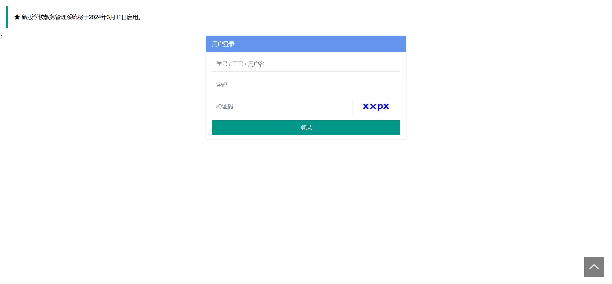
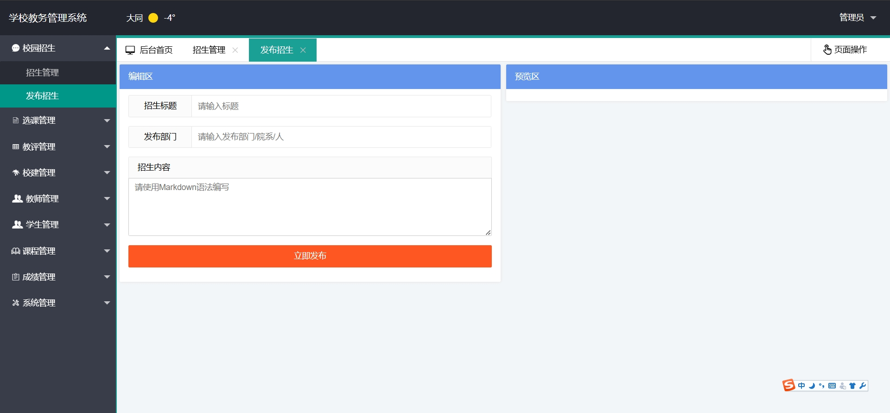
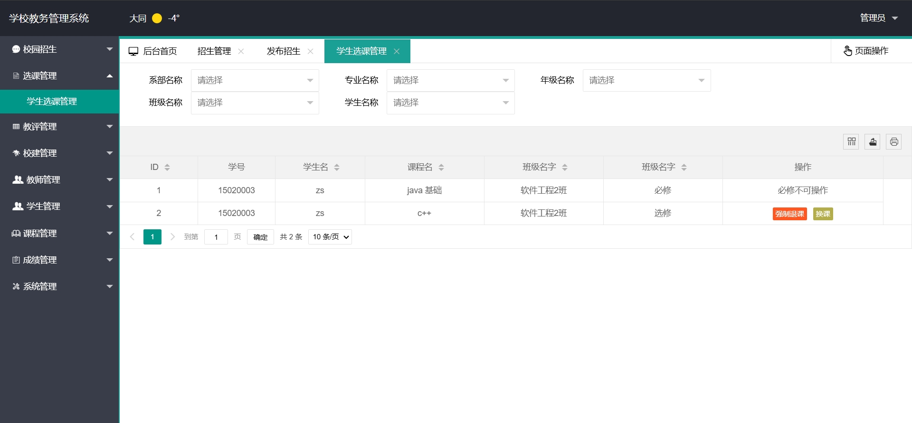
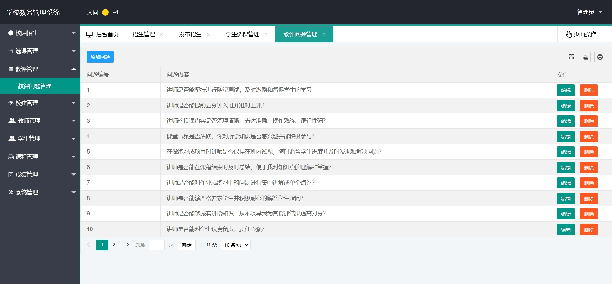
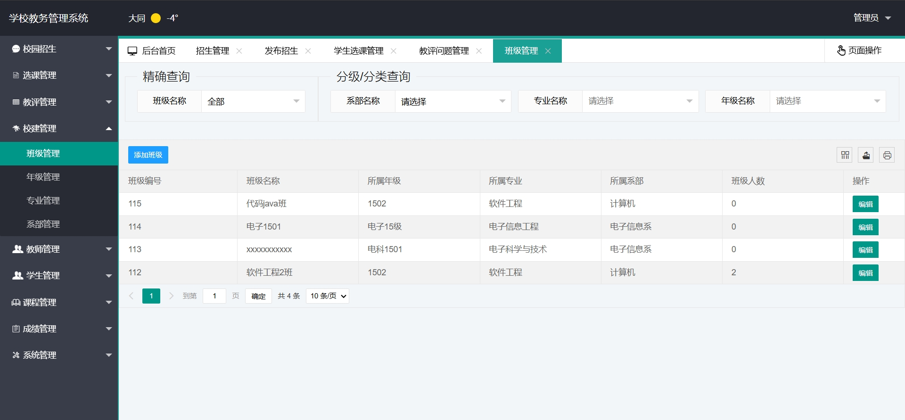
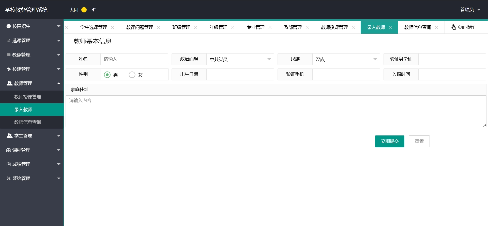
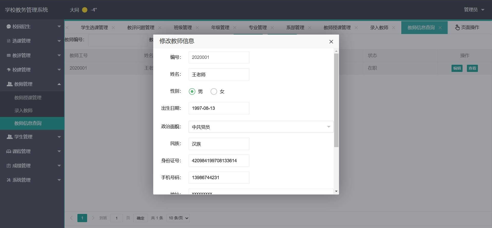
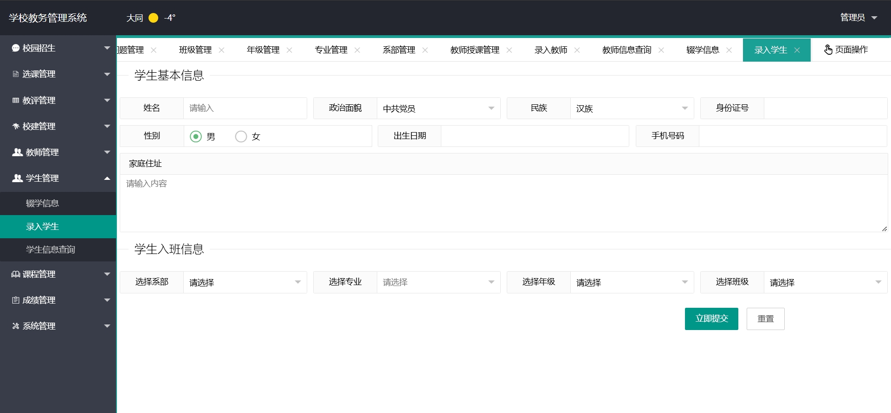
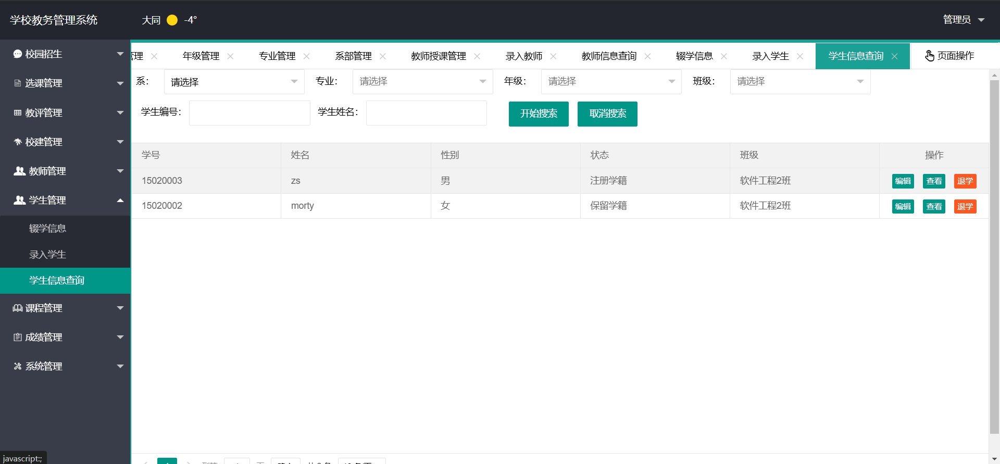
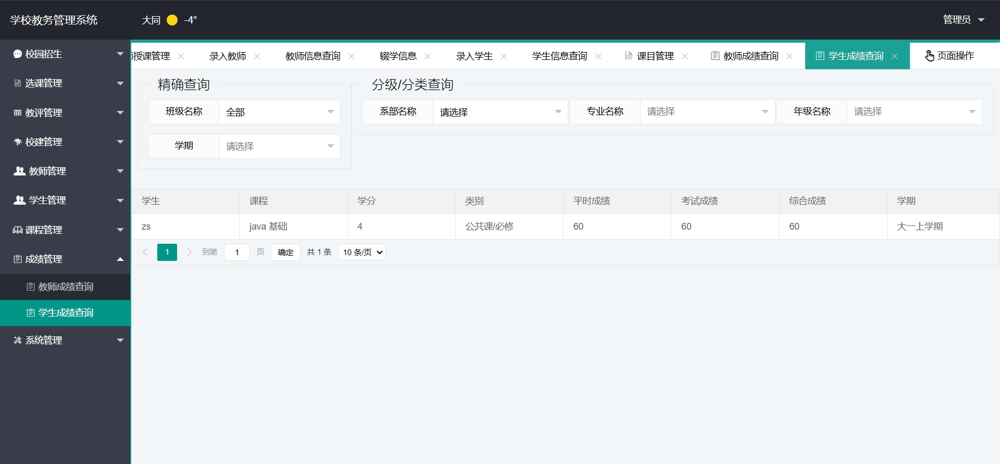
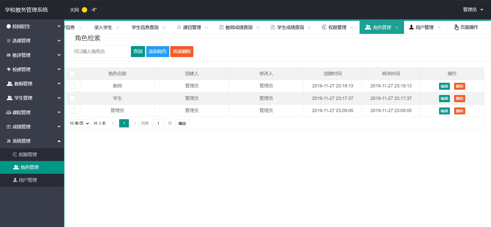
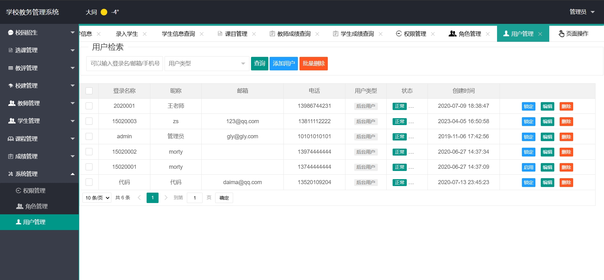
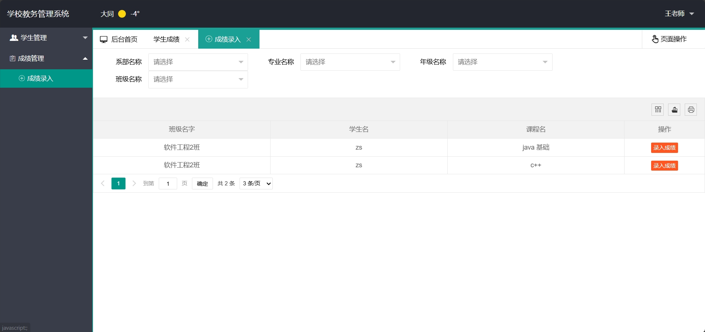
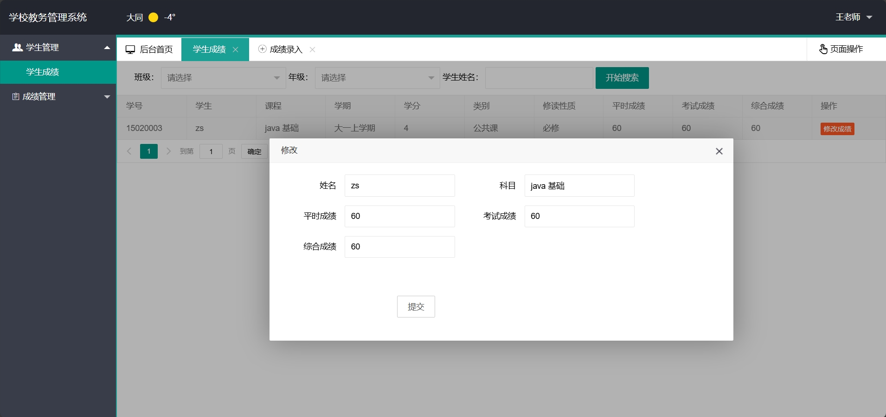
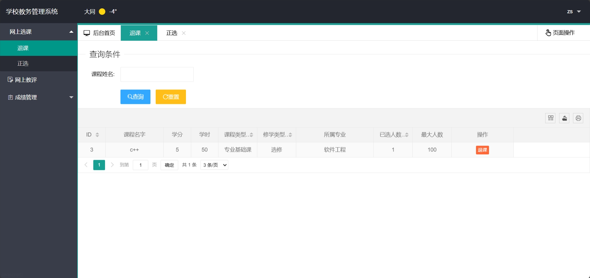
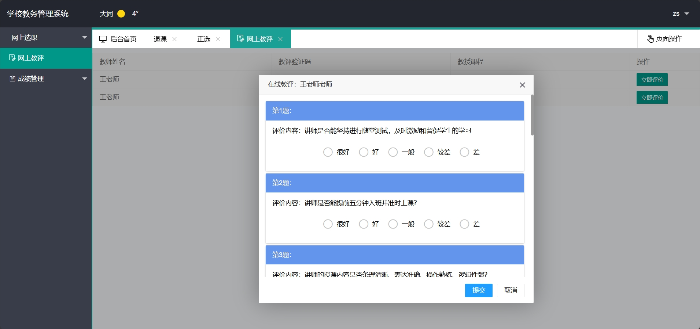
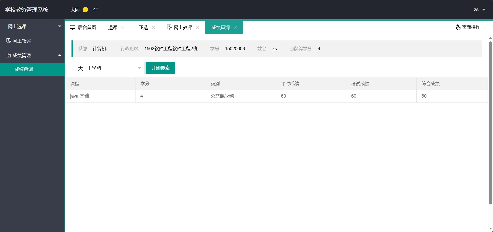
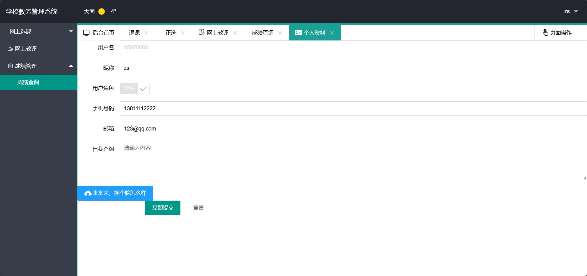

### 环境需求(可免费提供)
- idea/eclipse、jdk-1.8、maven-3.8.6、mysql、node.js等

## 有项目修改、安装调试需求 请联系以下

## 获取资源扫☝☝☝

